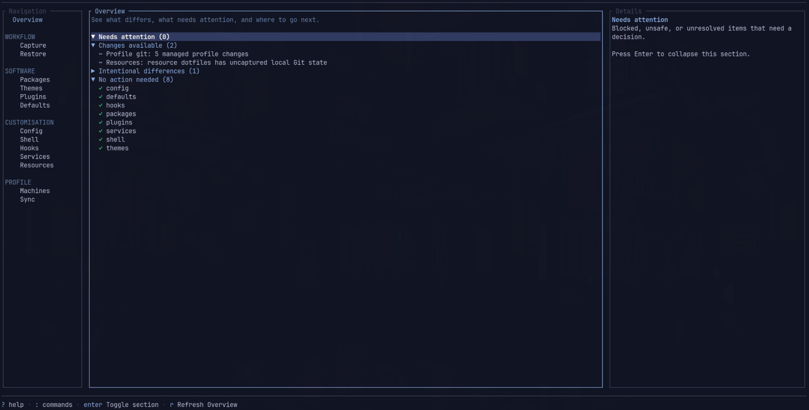
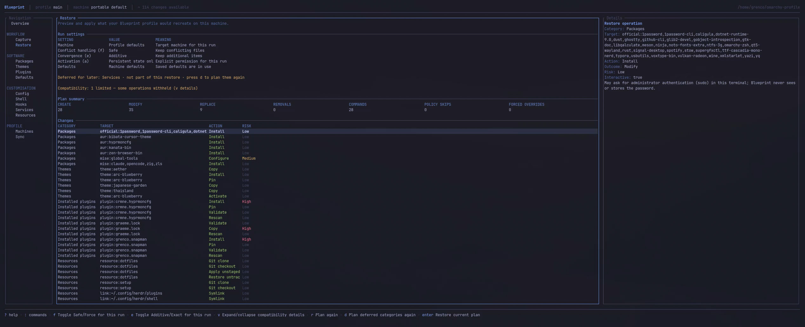

# Omarchy Blueprint

Use Omarchy normally. Blueprint remembers the meaningful choices needed to
rebuild your setup.

## What Blueprint does

The running system is the configuration editor: you install packages, pick a
theme, enable plugins, customise the shell, and edit config the normal way.
Blueprint captures that meaningful intent into a portable, readable profile
you can version-control and restore onto another Omarchy machine — preferring
to reconstruct things natively rather than blindly snapshot bytes.



## Installation

Blueprint is in early public beta. It requires Omarchy 4 or newer on x86_64.

Review each Restore plan (`omarchy-blueprint restore --dry-run`, or the review
screen in the TUI) before you apply it. Blueprint rebuilds your Omarchy
personalisation; it is not a backup tool, so keep independent backups of
personal data that matters.

### Install the packaged release

Blueprint is packaged as `omarchy-blueprint`, an Arch package built from the
release's source. It will be published on the Arch User Repository (AUR), but
the AUR is not accepting new account registrations yet, so it is not there.
Until it is, every [GitHub Release](https://github.com/Grenco/omarchy-blueprint/releases)
carries the same `PKGBUILD` the AUR will get. Download the latest one and build
it with `makepkg`, as you would an AUR package:

```sh
mkdir omarchy-blueprint && cd omarchy-blueprint
curl -fLO https://github.com/Grenco/omarchy-blueprint/releases/latest/download/PKGBUILD
less PKGBUILD
makepkg -si
```

`makepkg` downloads the release's source archive, checks it against the
SHA-256 pinned in the `PKGBUILD`, builds and tests it, and installs it with
pacman. `-s` installs the declared build dependencies it needs, notably the
`go` package, with pacman (it asks first). Omarchy's own Go comes from mise,
which pacman doesn't track, so `-s` installs pacman's `go` alongside it; use
`makepkg -sri` instead to remove the build dependencies again afterwards.

`makepkg -di` builds with whatever `go` is on your `PATH`, but `-d`
(`--nodeps`) turns off *all* of makepkg's dependency checks. Use it only if
you have already satisfied every dependency the `PKGBUILD` declares.

Check the result:

```sh
omarchy-blueprint --version          # omarchy-blueprint version <release>
pacman -Qo /usr/bin/omarchy-blueprint
```

To update, repeat these steps in a fresh directory. The TUI's Overview tells
you when a newer release is out (it never installs anything itself; set
`OMARCHY_BLUEPRINT_NO_UPDATE_CHECK=1` to turn the check off). Once the package
is on the AUR, pacman and AUR helpers treat it as the same package.

To uninstall:

```sh
sudo pacman -R omarchy-blueprint
```

Arch's default `makepkg.conf` also builds and installs
`omarchy-blueprint-debug`; add it to the command if
`pacman -Q omarchy-blueprint-debug` lists it. Uninstalling doesn't touch your
profiles or Blueprint's state in `~/.local/state/omarchy-blueprint`.

### Build from a Git checkout

For contributors. This needs Go 1.25 or newer, and pacman does not manage the
binary:

```sh
git clone https://github.com/Grenco/omarchy-blueprint.git
cd omarchy-blueprint
go build -trimpath -o omarchy-blueprint ./cmd/omarchy-blueprint
```

A Git build reports its version as `dev`.

### Reporting bugs

Open an issue at <https://github.com/Grenco/omarchy-blueprint/issues> and
include the output of `omarchy-blueprint --version`.

## Quick start

```sh
mkdir -p ~/omarchy-profile
omarchy-blueprint init ~/omarchy-profile --name main
omarchy-blueprint --profile ~/omarchy-profile capture
```

On another Omarchy machine, after cloning that profile:

```sh
omarchy-blueprint check
omarchy-blueprint status
omarchy-blueprint restore --dry-run
omarchy-blueprint restore
```

Prefer an interactive walkthrough? Run `omarchy-blueprint` with no arguments
to open the [TUI](docs/tui.md). Prefer scripting or automation? See the
[CLI guide](docs/cli.md).

## How it works

```text
Use Omarchy normally
        ↓
Capture
        ↓
Portable Blueprint profile
        ↓
Git / backup
        ↓
Another Omarchy machine
        ↓
Preview and approve restore
        ↓
Equivalent personalised environment
```

Where possible, Blueprint reconstructs from the most authoritative source
instead of copying unnecessarily: native Omarchy operations first, then the
native package manager, then an authoritative remote source, then captured
profile content, and manual action only when no safe automation exists. See
the [Guide](docs/guide.md) for the full mental model.

## What Blueprint can remember

| Category | What it covers |
| --- | --- |
| Packages | Explicitly installed system/AUR packages and global Mise tools |
| Themes | Your selected theme and the themes saved in your profile |
| Plugins | Omarchy plugin code and sources Blueprint can reconstruct |
| Defaults | Your default terminal, browser, editor, and agent |
| Config | Dotfiles and other app/system configuration, mainly under `~/.config` |
| Shell | Customised Omarchy shell, bar, and layout state |
| Hooks | Scripts Omarchy runs automatically at supported hook points |
| Resources | Files, folders, and Git projects you explicitly ask Blueprint to carry |

Machines control where a Resource lives on a particular computer, and Sync
manages the Git repository holding your profile — see the
[Guide](docs/guide.md) and [Resources guide](docs/resources.md) for detail.

## Safety model

Restore is a workflow, not a single mutating step:

```text
inspect → calculate → preview → approve → apply → verify
```

- Restore previews are non-mutating.
- Applying requires interactive approval or an explicit non-interactive `--yes`.
- Additional packages are never silently removed.
- Conflicts and existing user work are never silently overwritten.
- Blueprint does not intentionally capture secrets into the profile.

See the [Guide](docs/guide.md#safety-model) for the full safety picture.



## TUI and CLI

Both interfaces work from the same profile. The [TUI](docs/tui.md) is a
keyboard-first, decision-inbox style interface good for reviewing and acting
on differences interactively. The [CLI](docs/cli.md) is better for scripting
and automation; `omarchy-blueprint --help` is the canonical reference for
every flag and subcommand.

## Documentation

- [Guide](docs/guide.md) — how Blueprint thinks about capture, profiles, restore, and safety.
- [TUI](docs/tui.md) — interactive navigation and screen purposes.
- [CLI](docs/cli.md) — common command-line workflows.
- [Resources](docs/resources.md) — explicitly tracked files, folders, and per-machine paths.
- [All documentation](docs/README.md)

[ROADMAP.md](ROADMAP.md) is the working product specification for anyone
interested in project direction rather than day-to-day use.

## Requirements

- Omarchy 4 or newer
- Go 1.25 or newer when building from source
- `pacman` and the public `omarchy` CLI on `PATH`

## Build and test

```sh
go test ./...
go vet ./...
go build ./cmd/omarchy-blueprint
```

## Project status

Blueprint is in early public beta: a working, actively developed
specification implementation.
Current boundaries — such as which conflicts restore can resolve
automatically and which state remains machine-specific — are documented in
the [Guide](docs/guide.md#current-boundaries).
